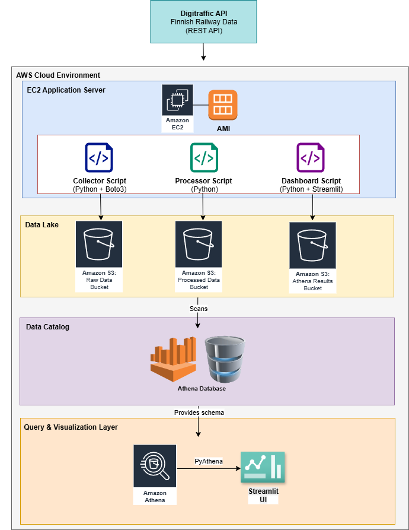

# VR Train Delay Analytics

An **Analytics-as-a-Service (AaaS)** platform built on AWS for processing, analyzing, and visualizing Finnish railway delay data from the Digitraffic API.

## Project Overview

This project builds a cloud-based system to analyze train delay patterns within Finland's national train system, providing insights through multiple access methods: batch downloads, streaming simulation with interactive dashboards.

## Features

* **Batch Processing:** Download historical delay data as CSV/Parquet files from S3
* **Streaming Simulation:** Simulate real-time train delay events 
* **Interactive Dashboard:** Visualize trends and patterns with Streamlit 
* **Cost-Optimized:** Designed for student budgets with AWS free tier usage

## Architecture

*High-level system architecture showing AWS services and data flow*

## Data Flow

*Step-by-step journey of data from source to dashboard*

## Technology Stack

### Data Layer
* **Data Storage:** Amazon S3 (Raw JSON & Processed Parquet/CSV)
* **Data Processing:** AWS Glue Jobs, AWS Lambda
* **Analytics & Querying:** Amazon Athena
* **Database:** Partitioned external tables for cost efficiency

### Application Layer
* **Real-time Streaming:** Amazon Kinesis Data Streams
* **API Layer:** Amazon API Gateway, AWS Lambda
* **Dashboard:** Streamlit (hosted on Streamlit Cloud)
* **Authentication:** Basic API key authentication

### Infrastructure
* **Infrastructure as Code:** Terraform
* **Monitoring:** AWS CloudWatch
* **Version Control:** Git with collaborative workflows

## Dashboard Setup (Streamlit)

### Local Development
1. Navigate to streamlit directory: 
cd src/
2. Install dependencies:
pip install -r requirements.txt
3. Run dashboard locally: 
streamlit run dashboard.py --server.port 8501 --server.address 0.0.0.0
4. Open browser to `http://[PUBLICHOSTIP]:8501`

### Dashboard Features
The Streamlit dashboard provides 5 key visualizations:
- **Top 10 Most Delayed Train Types**
- **Average Delay by Train Type** 
- **Top 15 Most Delayed Routes** 
- **Average Delay by Route** 

## 🚀 Quick Start

### Prerequisites
- AWS CLI configured with credentials (AWS Learner Lab)
- Terraform installed (v1.0+)
- Python 3.8+ for local dashboard development
- Git for version control

### Infrastructure Deployment
1. Clone this repository:
git clone https://github.com/Wei-Seng/vr-train-delay-analytics.gitcd vr-train-delay-analytics

2. Navigate to terraform directory:
cd terraform

3. Initialize Terraform:
terraform init

4. Review and deploy infrastructure:
terraform plan
terraform apply

### Accessing the System
* **Dashboard URL:** Available after Streamlit deployment
* **Data Storage:** Check AWS S3 console for bucket creation
* **Analytics:** Access via AWS Athena console

## Cost Optimization

This project is designed for student budgets (target: <100 SGD total):
- **S3 Storage:** ~$1-2 for entire project duration
- **Athena:** Pay-per-query (very affordable for coursework)
- **Streamlit:** Free hosting on Streamlit Cloud

### Sample API Endpoints
GET /delays/route/HKI/TPE?start=2023-01-01&end=2023-01-31GET /delays/stations/HKI
GET /trains/IC123/events

## Development Workflow
1. **Data Development:** Work with sample data locally first
2. **Infrastructure:** Test Terraform changes in development environment  
3. **Dashboard:** Develop Streamlit app with mock data
4. **Integration:** Connect dashboard to real AWS services
5. **Deployment:** Deploy to Streamlit Cloud for sharing

## External Resources
- [Digitraffic Railway API](https://www.digitraffic.fi/rautatieliikenne/)
- [AWS Terraform Documentation](https://registry.terraform.io/providers/hashicorp/aws/latest/docs)
- [Streamlit Documentation](https://docs.streamlit.io/)

## 📄 License
MIT License - see [LICENSE](LICENSE) file for details.

## Contributing
1. Create feature branches for new development
2. Follow commit message conventions  
3. Test changes locally before pushing
4. Update documentation as needed